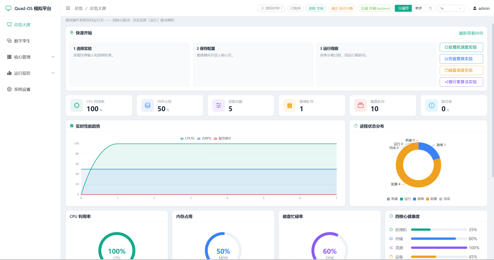
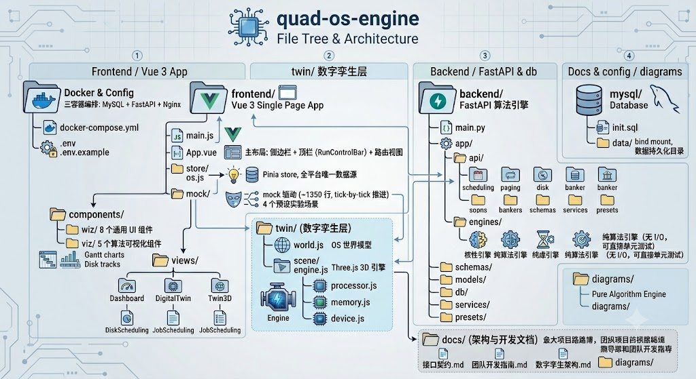

# Quad-OS 综合操作系统模拟平台

一个**企业级仪表盘风格**的综合操作系统模拟平台，把四个 OS 核心（处理机调度 / 存储管理 / 进程与资源 / 设备管理）整合成一个**运行中的虚拟操作系统**，通过总览大屏、实时监控、事件查询与系统告警统一呈现。

## 界面预览



## 功能

- **总览大屏**：全局 KPI、CPU/内存/磁盘仪表盘、性能趋势曲线、进程状态环图、四核心健康度、实时事件流、运行快照。
- **四核心联动**：一个虚拟 OS 运行作业流，贯穿处理机调度 → 存储分页 → 资源分配 → 磁盘 I/O，各核心可下钻深入页。
- **运行控制**：顶部统一「运行 / 暂停 / 单步 / 速度」驱动虚拟时钟，全平台联动。
- **运行监控**：实时监控（全维度快照）、事件查询（筛选/分页/导出）、系统告警（死锁/缺页/资源异常分级）。
- **系统设置**：调度算法、内存块数、资源总量、磁道数、时钟速度等参数配置。

## 架构与状态

平台采用**中央 OS 状态 store**作为唯一数据源，所有页面只读它，因而天然联动；一个 mock 驱动按虚拟时钟产出连贯的「OS 运行叙事」让平台「活」起来。

| 阶段 | 状态 |
|---|---|
| **后端算法引擎** | ✅ 已完成 —— FastAPI + 5 引擎（作业/页面/磁盘/银行家/PV）+ MySQL + 报告导出，**40 个 pytest 全绿**，保留在 `backend/` 备用 |
| **前端综合平台脚手架** | ✅ 已完成 —— Vue3 + Element Plus + ECharts + Pinia，9 个页面 + 通用组件 + mock 驱动，浏览器走查无报错 |
| **真实逻辑接入** | ⏳ 团队开发阶段 —— 把 mock 驱动替换为调用后端引擎（已留接缝），见 [团队开发指南](docs/团队开发指南.md) |

## 技术栈

| 层 | 技术 |
|---|---|
| 前端 | Vue 3 + Element Plus + Vite + ECharts + Pinia |
| 后端（已备） | FastAPI (Python 3.12) + SQLAlchemy 2.0 + MySQL 8.0 |
| 部署 | Docker Compose + Nginx |

## 快速开始

### 前端本地开发

```bash
cd frontend
npm install
npm run dev        # http://localhost:5173 —— 纯前端 + mock，无需后端
```

进入后点击顶部「运行」，即可看到虚拟 OS 在四核心间联动运转。

### Docker Compose 完整栈

```bash
copy .env.example .env
docker compose up -d --build
```

访问入口：`http://localhost:8088`。完整栈包含 MySQL、FastAPI 后端和前端 nginx 网关三个容器；前端 nginx 同时负责 SPA 静态资源和 `/api` 反向代理。

常用检查：

```bash
docker compose ps
docker compose logs -f backend
docker compose logs -f frontend
```

后端直连调试端口默认是 `http://localhost:8080/api/health`，正常演示优先访问 `8088`。

## 目录结构



```
quad-os-engine/
├── docker-compose.yml          # 三容器编排：MySQL + FastAPI + Nginx
├── .env / .env.example         # 环境变量配置
│
├── backend/                    # FastAPI 算法引擎（保留备用）
│   ├── main.py                 # 入口：10 路由 + CORS + 生命周期
│   ├── requirements.txt        # Python 依赖
│   ├── Dockerfile
│   ├── pytest.ini
│   └── app/
│       ├── __init__.py
│       ├── api/                # 10 个 REST 路由模块
│       │   ├── __init__.py
│       │   ├── scheduling.py   # POST /api/scheduling/run
│       │   ├── paging.py       # POST /api/paging/run + /translate
│       │   ├── disk.py         # POST /api/disk/run + /simulate + /benchmark
│       │   ├── banker.py       # POST /api/banker/safety + /request
│       │   ├── process.py      # POST /api/process/tick + /run
│       │   ├── sync.py         # POST /api/sync/run
│       │   ├── presets.py      # GET /api/presets/{module}
│       │   ├── report.py       # POST /api/report/markdown
│       │   ├── scenarios.py    # GET/POST/DELETE /api/scenarios
│       │   └── history.py      # GET/POST /api/history
│       ├── engines/            # 5 个纯算法引擎（无 I/O，可直接单元测试）
│       │   ├── __init__.py
│       │   ├── scheduling_engine.py  # FCFS / SJF / HRRN / PRIORITY / RR
│       │   ├── paging_engine.py      # FIFO / LRU / OPT / CLOCK + 地址转换
│       │   ├── disk_engine.py        # 8 种移臂算法 + 完整 I/O 模拟
│       │   ├── banker_engine.py      # 银行家安全性 + 请求试探
│       │   └── sync_engine.py        # PV 信号量 + 生产者-消费者
│       ├── schemas/            # Pydantic 请求/响应模型
│       │   ├── __init__.py
│       │   ├── common.py       # SimulationStep + SimulationTrace（统一契约）
│       │   ├── scheduling.py
│       │   ├── paging.py
│       │   ├── disk.py
│       │   ├── banker.py
│       │   ├── process.py
│       │   └── sync.py
│       ├── models/             # SQLAlchemy ORM
│       │   ├── __init__.py
│       │   ├── base.py
│       │   ├── scenario.py     # Scenario（场景库）
│       │   └── run_history.py  # RunHistory（运行历史）
│       ├── db/
│       │   ├── __init__.py
│       │   └── mysql.py        # 异步 MySQL 连接（aiomysql）
│       ├── services/
│       │   ├── __init__.py
│       │   ├── scenario_service.py
│       │   ├── history_service.py
│       │   └── report_service.py  # SimulationTrace → Markdown 实验报告
│       └── presets/
│           ├── __init__.py
│           └── data.py         # 教材预设实验数据
│
├── frontend/                   # Vue 3 单页应用
│   ├── package.json            # Vue 3 + Element Plus + ECharts + Pinia + Three.js + vue-router
│   ├── package-lock.json
│   ├── vite.config.js
│   ├── Dockerfile
│   ├── nginx.conf              # SPA 静态资源 + /api 反向代理到 backend:8080
│   ├── index.html
│   └── src/
│       ├── main.js             # 入口：Vue + Pinia + Element Plus + Router
│       ├── App.vue             # 主布局：侧边栏 + 顶栏（RunControlBar）+ 路由视图
│       ├── styles.css
│       ├── styles/theme.css    # CSS 变量主题
│       ├── api/
│       │   └── client.js       # 封装全部 11 个后端 API 调用
│       ├── store/
│       │   └── os.js           # 中央 OS 状态（Pinia store，全平台唯一数据源）
│       ├── mock/
│       │   ├── seed.js         # 初始状态种子（进程/内存/磁盘/资源/同步全量数据）
│       │   ├── driver.js       # 核心 mock 驱动（~1350 行，tick-by-tick 推进）
│       │   └── experiments.js  # 4 个预设实验场景（调度/分页/磁盘/银行家）
│       ├── composables/
│       │   ├── useSimulation.js  # 通用分步 trace 播放器
│       │   └── useChart.js
│       ├── router/
│       │   └── index.js        # 11 个路由
│       ├── components/
│       │   ├── MetricCards.vue
│       │   ├── StepControls.vue
│       │   ├── StepLog.vue
│       │   ├── widgets/        # 8 个通用 UI 组件
│       │   │   ├── StatCard.vue
│       │   │   ├── GaugePanel.vue
│       │   │   ├── TrendChart.vue
│       │   │   ├── RingChart.vue
│       │   │   ├── EventFeed.vue
│       │   │   ├── RunControlBar.vue
│       │   │   ├── SectionCard.vue
│       │   │   └── StatusBadge.vue
│       │   └── viz/            # 5 个算法可视化组件
│       │       ├── GanttChart.vue
│       │       ├── DiskTrack.vue
│       │       ├── PageFrames.vue
│       │       ├── BankerMatrix.vue
│       │       └── BufferRing.vue
│       ├── twin/               # 数字孪生层
│       │   ├── world.js        # OS 世界模型（渲染无关，useOsWorld）
│       │   └── scene/          # Three.js 3D 引擎
│       │       ├── engine.js    # 场景编排
│       │       ├── pipeline.js  # 渲染管线
│       │       ├── materials.js # PBR + ACES
│       │       ├── stage.js     # 灯光/相机
│       │       ├── layout.js    # 布局
│       │       ├── label.js     # 标签
│       │       ├── interactions.js
│       │       └── cores/       # 五核心建模
│       │           ├── _common.js
│       │           ├── kernel.js
│       │           ├── processor.js
│       │           ├── memory.js
│       │           ├── resource.js
│       │           └── device.js
│       ├── utils/
│       │   └── report.js
│       └── views/              # 17 个页面视图（11 个路由 + 6 个独立）
│           ├── Dashboard.vue       # 总览大屏
│           ├── DigitalTwin.vue     # 数字孪生 2D 控制台
│           ├── Twin3D.vue          # 数字孪生 3D 写实主板
│           ├── Home.vue            # 首页
│           ├── RealtimeMonitor.vue # 实时监控
│           ├── EventQuery.vue      # 事件查询
│           ├── AlarmCenter.vue     # 系统告警
│           ├── SystemSettings.vue  # 系统设置
│           ├── DiskScheduling.vue  # 磁盘调度（独立页）
│           ├── JobScheduling.vue   # 作业调度（独立页）
│           ├── PageReplacement.vue # 页面置换（独立页）
│           ├── ProcessSync.vue     # 进程同步（独立页）
│           ├── ResourceAllocation.vue # 资源分配（独立页）
│           └── cores/
│               ├── ProcessorCore.vue  # 处理机调度（核心页）
│               ├── MemoryCore.vue     # 存储管理（核心页）
│               ├── ResourceCore.vue   # 进程与资源（核心页）
│               └── DeviceCore.vue     # 设备管理（核心页）
│
├── mysql/
│   ├── init.sql                # 建表脚本（scenarios + run_history）
│   └── data/                   # MySQL 运行时数据（bind mount，数据持久化目录）
│
├── docs/                       # 架构与开发文档
│   ├── 接口契约.md             # 中央 store 数据结构 + 后端 API 端点契约
│   ├── 团队开发指南.md          # 6 条并行工作线 + 分支策略 + 验收标准
│   ├── 数字孪生架构.md          # 三层架构：数据源→世界模型→渲染层
│   └── diagrams/               # 架构图（Mermaid 源文件 + 生成 PNG）
│       ├── architecture.mmd
│       ├── architecture.png
│       ├── twin-architecture.mmd
│       ├── twin-architecture.png
│       ├── mock-causal.mmd
│       └── mock-causal.png

```

## 团队开发

四个核心 + 平台为 6 条可并行的工作线，只通过中央 store 契约交互。详见 [docs/团队开发指南.md](docs/团队开发指南.md) 与 [docs/接口契约.md](docs/接口契约.md)。
